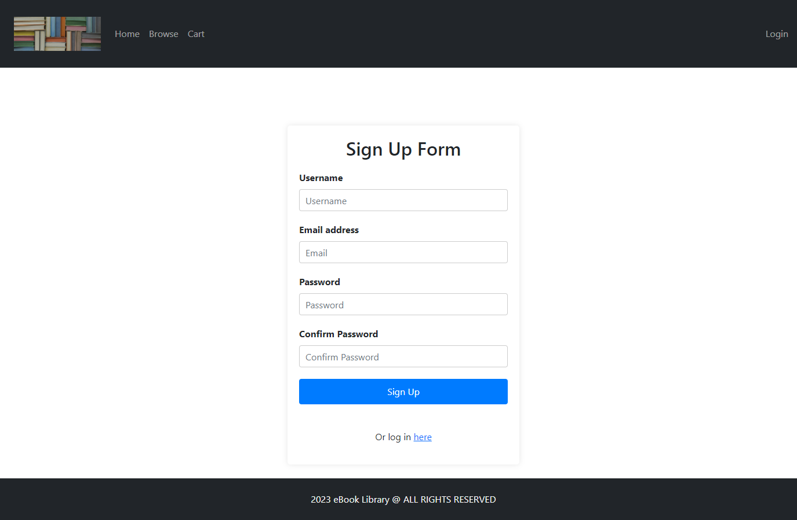

# team-9-project-2

## Description

The eBook Library project is a web application that allows users to browse and access a collection of eBooks. It provides a user-friendly interface for navigating through different sections of the library and managing a user's cart. The project is built using HTML, CSS, JavaScript, and utilizes the Bootstrap framework for responsive design.

## Table of Contents 

* Usage
* The Challenge
* Technologies Used 
* Collaborators 
* Mock-Up
* Link to Deployed Site/GitHub Repo
* Copyright


## Usage

1. Clone or download the repository.
2. Open the index.html file in a web browser.
3. Navigate through the different sections using the links in the navbar.
4. If logged in, the user's email will be displayed in the navbar. Otherwise, a link to log in is shown.
5. Explore and interact with the application to browse eBooks and manage the cart.


## The Challenge
```
* Use Node.js and Express.js to create a RESTful API.

* Use Handlebars.js as the template engine.

* Use MySQL and the Sequelize ORM for the database.

* Have both GET and POST routes for retrieving and adding new data.

* Use at least one new library, package, or technology that we haven’t discussed.

* Have a folder structure that meets the MVC paradigm.

* Include authentication (express-session and cookies).

* Protect API keys and sensitive information with environment variables.

* Be deployed using Heroku (with data).

* Have a polished UI.

* Be responsive.

* Be interactive (i.e., accept and respond to user input).
```

## Technologies Used

This app was built using the following technologies:

* HTML
* CSS
* Bootstrap framework 
* JavaScript 
* jQuery
* OpenAI
* APIs
* Handlebars
* BCrypt


## Collaborators 

* Andrew Clark
* Saria Elchaar
* Antonio Lu
* Beverley Witherington
* Hugo Smith Witherington


## Mock-Up

The following image shows the web application's appearance and functionality:

### Home Page


### Browse Page


### Cart Page


### Login Page


### Sign Up Page


### Upload Page


## Link to Deployed Site/GitHub Repo

* Heroku: https://team9-ebook-library.herokuapp.com/
* GitHub Repo: https://github.com/Saria995/team-9-project-2.git

## Copyright 

N/A 
